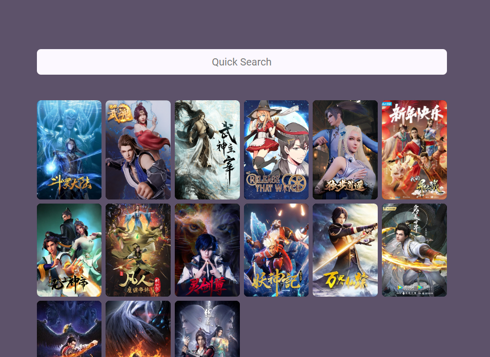

O website tem como objetivo possibilita armazenar o progresso da sua série favorita. Apesar do aplicativo de chamar myanimes-app ele funciona para todo e qualquer coleção de série. Animes, Filmes, Séries e etc.

<p align="center">
  
</p>

## :bulb: Instalação

Abaixe o projeto com

```shell
git clone https://github.com/thelokys/myanimes-app.git # HTTPS
ou
git clone git@github.com:thelokys/myanimes-app.git # SSH
```

Entre da pasta do projeto`cd myanimes-app/`

## :rocket: Executando projeto

em progresso..
